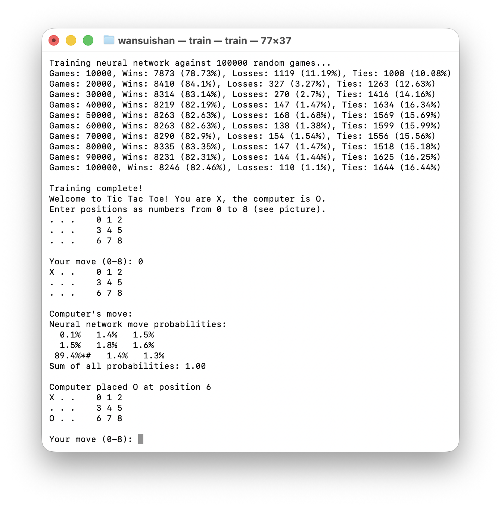

[images/Tic.png]


# 基于强化学习训练 MLP 感知机进行井字棋游戏决策

用 C++ 实现基于强化学习、使用多层感知机（MLP）作为策略模型，让智能体通过自我对弈学习井字棋（Tic-Tac-Toe）游戏的最佳策略。

## 🔍 项目简介

- 使用强化学习方法训练智能体。
- 模型结构为简单的多层感知机（MLP），输入为当前棋盘状态，输出为各个落子位置的估值或概率。
- 训练过程中，智能体通过vs随机决策，学习胜负反馈，不依赖预定义规则。


## 🎮 训练与游戏




## 🗂️ 项目结构
```
├── gomoku/                   
│   ├── gomoku.cpp          # 井字棋逻辑
│   └── gomoku.h           
├── model/ 
│   ├── mlp.cpp             # 多层感知机模型
│   └── mlp.h 
├── train.cpp               # 模型训练
├── README.md               # 项目说明
└── Makefile                # 编译脚本
```


## 🚀 快速启动

```bash
# 使用 make 构建
make
```
